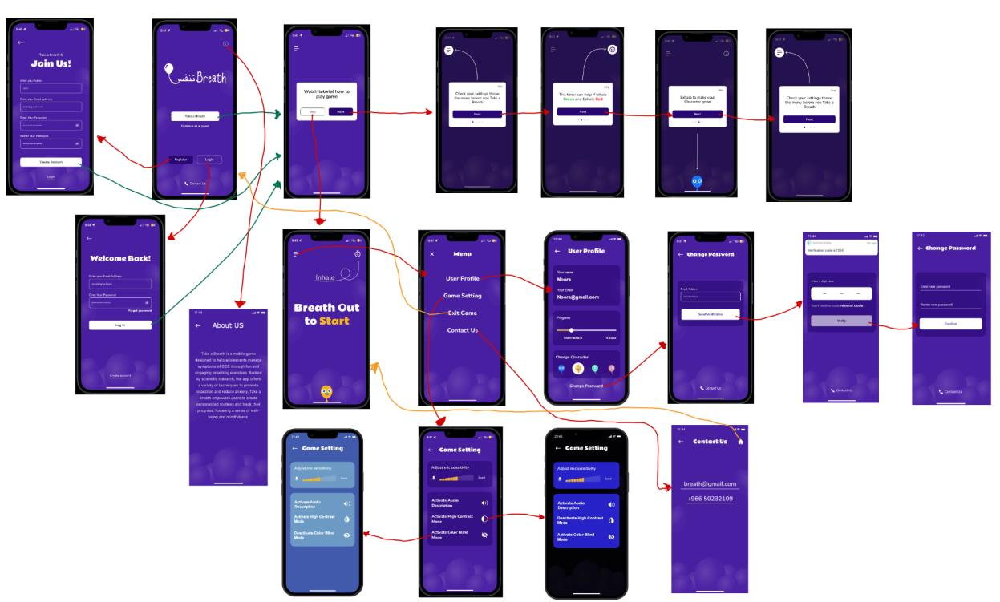
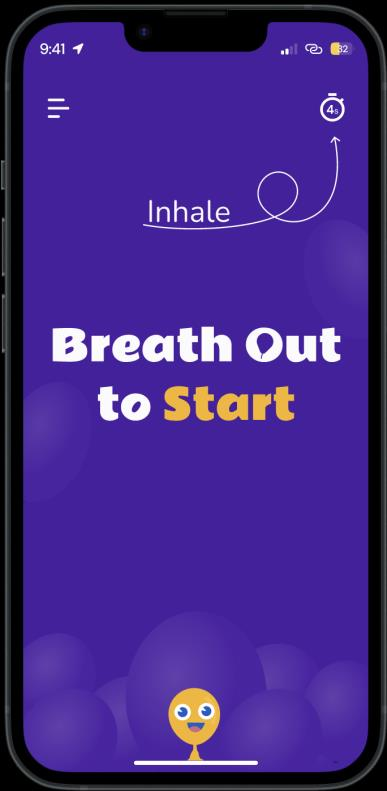
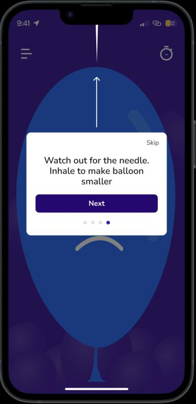
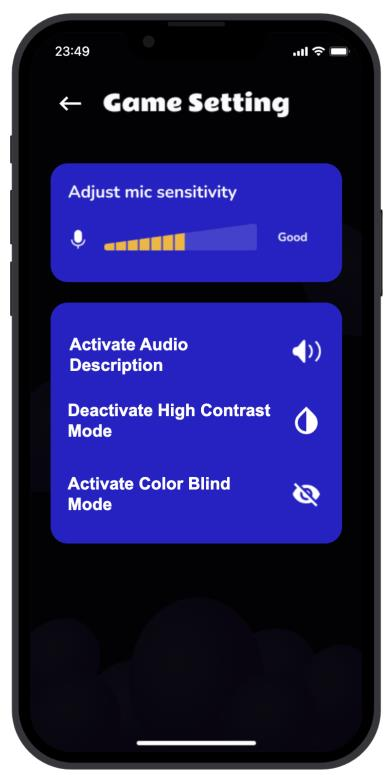

# Breath | تـنـفـــس — Design Case Study

A mobile game that turns **breathing therapy into play** for adolescents (13–17) managing OCD: your actual breath, captured through the microphone, is the game controller. Exhale to start; inhale to shrink the balloon away from the needle; steady breathing keeps your character alive and growing. The therapy *is* the gameplay.

This repo is the HCI design case study — high-fidelity prototype, design rationale, and evaluation. (No code: the deliverable was a validated interactive prototype.)

## The core mechanic

| Start by exhaling | Breath-controlled balloon | Accessible by design |
|---|---|---|
|  |  |  |

Breathing exercises are the evidence-based intervention for OCD-related anxiety — but teenagers abandon exercises that feel clinical. Making the breath itself the input device means you cannot play without doing the therapy.

## Design process

- **Lo-fi → hi-fi**: paper concepts → Figma → an interactive **Proto.io** prototype (chosen after evaluating iOS prototyping options through the **DECIDE framework** under a 4-week constraint).
- **Slice approach**: rather than shallow-prototyping everything, we built the critical first-session path deep — onboarding, tutorial, first game — because a therapy app lives or dies on first impressions.
- **Design principles**: Shneiderman's 8 Golden Rules applied and documented screen-by-screen (visibility of status via animation/audio cues, recognition over recall, error prevention, minimalist calming aesthetic).
- **Accessibility as a feature, not an afterthought**: color-blind mode, high-contrast mode, audio descriptions, adjustable mic sensitivity, customizable avatars.

## Evaluation

Two independent tracks:

1. **User testing with adolescents diagnosed with OCD** (with participant/guardian consent and anonymized feedback) — task-based sessions on the interactive prototype.
2. **Expert reviews** against Nielsen's usability heuristics, documented rule-by-rule.

Findings converged: the calming visual language and simple navigation carried the therapeutic intent, and reviewers highlighted the potential of gamified therapy to lower barriers to treatment for a stigmatized condition.

## Credits

SE365 Human–Computer Interaction, Prince Sultan University — supervised by **Dr. Sofianiza Abd Malik**. Team: **Rasha AlNaji**, Noora Alsarhan, Reema Alkuaik, Hallah Alfaraj.
